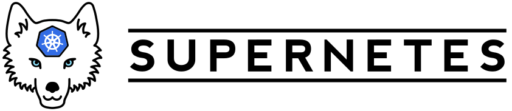
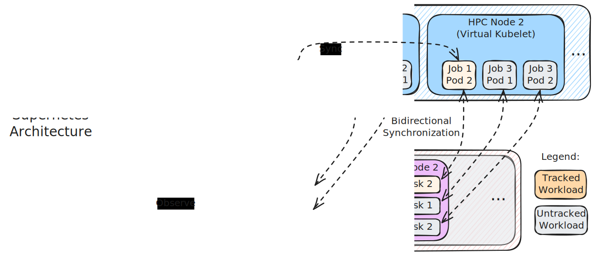

[](#)

[](https://goreportcard.com/report/github.com/supernetes/supernetes/agent)
[](https://goreportcard.com/report/github.com/supernetes/supernetes/common)
[](https://goreportcard.com/report/github.com/supernetes/supernetes/config)
[](https://goreportcard.com/report/github.com/supernetes/supernetes/controller)
[](https://github.com/supernetes/supernetes/releases)

> [!NOTE]
>
> 📣 **Supernetes will be [on stage](https://kccnceu2025.sched.com/event/1tx7r/thousands-of-virtual-kubelets-1-to-1-mapping-a-supercomputer-to-kubernetes-with-supernetes-dennis-marttinen-aalto-university) at KubeCon + CloudNativeCon EU 2025!**
>
> Join [@twelho](https://github.com/twelho) for an exploration into the HPC-to-cloud bridge landscape and hear the Supernetes origin story, with architectural deep dives and a live demo! Check out [Thousands of Virtual Kubelets: 1-to-1 Mapping a Supercomputer To Kubernetes With Supernetes](https://kccnceu2025.sched.com/event/1tx7r/thousands-of-virtual-kubelets-1-to-1-mapping-a-supercomputer-to-kubernetes-with-supernetes-dennis-marttinen-aalto-university)!

**Supernetes** (*Supercomputer* + *Kubernetes*) is a High Performance Computing (HPC) bridge for your Kubernetes environment: Expose your HPC nodes and jobs to Kubernetes-native tooling and schedulers, abstracting away the HPC-specifics. The goal is to provide a (near) complete abstraction: simulating what it would be like if your legacy HPC system ran Kubernetes natively.

## Architecture

Supernetes consists of two major components: the **controller** and the **agent**. The controller runs in a Kubernetes cluster providing the Kubernetes endpoint. The agent runs in your HPC environment, for example, on a login node, and interfaces with the HPC scheduler, such as Slurm.



To avoid challenges with firewalls in the HPC environment, the agent initiates an mTLS-secured connection to the controller (passing through the Gateway API endpoint of your Kubernetes cluster). Through a [GRPC reverse tunnel](https://github.com/jhump/grpctunnel) the roles are then reversed such that the controller can issue RPC calls against the agent. Once the connection has been established, the controller starts two reconciliation loops:

1. The controller periodically queries the agent for the HPC nodes. The agent uses `scontrol` to discover the nodes (respecting configured filters), and sends this information to the agent via the [Supernetes node API](src/api/v1alpha1/node.proto). For each node, the controller then deploys a [Virtual Kubelet](https://virtual-kubelet.io) instance that represents the HPC node as Kubernetes node.
2. The controller periodically queries the agent for the HPC jobs. The agent uses `scontrol` to observe the jobs (respecting configured filters), and sends this information to the agent via the [Supernetes workload API](src/api/v1alpha1/workload.proto). The controller then translates a job into one or more Pods (depending on the individual tasks of that job) that are scheduled onto the corresponding Virtual Kubelet nodes. Unscheduled jobs (pending, failed etc.) are also synchronized accordingly. Workloads sourced in this way (and not associated with a user Pod) are called **untracked** in Supernetes terminology (e.g., job 2 and job 3 in the above diagram).

Finally, the controller also observes any Pods that users deploy directly to its Virtual Kubelet nodes. These are called **tracked** workloads, which will get transferred to the agent via the [Supernetes workload API](src/api/v1alpha1/workload.proto) and dispatched as Slurm jobs using `sbatch`. The dispatching occurs using an HPC container runtime, currently [Apptainer](https://apptainer.org/) and [SingularityCE](https://sylabs.io/singularity/) are supported. The OCI container image in the Pod specification is directly passed to this runtime. The returned job identifier is then used to associate and synchronize the status of the user's Pod with the reconciled Pods representing the job's tasks (e.g., job 1's Pods in the above diagram).

## Features

- [x] Built for and running on the [LUMI Supercomputer](https://www.lumi-supercomputer.eu/about-lumi/)
- [x] Full bidirectional and eventually consistent state reconciliation of all Slurm jobs and all HPC nodes
  - [x] HPC nodes are translated to Virtual Kubelet instances 1-to-1
  - [x] Existing Slurm jobs are translated to Kubernetes Pods (untracked workloads)
  - [x] Kubernetes Pods are deployed as containerized Slurm jobs (tracked workloads)
- [x] Tolerates the strictest HPC limitations (from LUMI). Running Supernetes requires
  - no root access,
  - no `fakeroot`,
  - no privileged namespaces,
  - no unprivileged (user) namespaces,
  - no `slurmrestd` API, and
  - no ports to be opened in the firewall (not even SSH).
  - If you can run `sbatch` and `scontrol`, you can run Supernetes!
- [x] mTLS 1.3 certificate-based authentication and end-to-end encryption with ED25519 keys between the controller and agent
- [x] Scalable: reconciling over 1000 HPC nodes with jobs has been tested
- [x] Container image packaging with GHCR
- [x] Kustomization for continuous deployment
- [ ] Per-workload Slurm partition selection (https://github.com/supernetes/supernetes/issues/32)
- [x] Metrics support for Virtual Kubelet nodes
- [x] Log retrieval/streaming support for tracked workloads
- [ ] Complete node state reconciliation (https://github.com/supernetes/supernetes/issues/35)

## Building

The build system requires (rootless) `docker` (or Podman symlinked to `docker`), `make` and `git` to be present on your system. To build the `agent`, `controller` and `config` binaries, simply run

```shell
make
```

The resulting binaries will be placed in [`bin`](bin).

To build the controller as a container image, run

```shell
make image-build
```

To clean up any build artifacts, run

```shell
make clean
```

## Usage

### Prerequisites

- Access to an HPC/Supercomputer environment
  - Slurm must be installed and operational (`sbatch`, `scontrol` etc. available).
  - Either Apptainer or SingularityCE must be present and operable through `sbatch`. The container runtime must also be able to pull the OCI images intended to be deployed via Supernetes.
  - You also need a default Slurm account and partition to dispatch jobs.
- A Kubernetes cluster
  - A single-node cluster with 16 GiB of RAM can sustain reconciling around 1000 nodes
  - The cluster must be accessible from the HPC environment. The most portable way to achieve this is using a public IP (with or without a DNS record) and an Ingress or Gateway API (preferred) setup.
  - Supernetes has thus far only been tested on Kubernetes v1.31, but it **may** work on older versions. No guarantees.

### Configuration

This is a **mandatory** step in order to configure the Supernetes deployment and establish mTLS trust between the controller and agent. You will need the `controller.yaml` and `agent.yaml` configuration files, which can be generated using the `config` tool. Do not forget to specify `--agent-endpoint` to point to an IP or DNS record with an ingress path to the Supernetes controller in your Kubernetes cluster. Port `443` will be used if not specified.

By default, `controller.yaml` is generated as a Kubernetes [Secret](https://kubernetes.io/docs/concepts/configuration/secret/). Once you have deployed the Supernetes controller (see below), apply the Secret with `kubectl apply -f controller.yaml`.

```shell
$ ./bin/config generate --help

Generate linked configuration files for a controller and an agent. The
configuration file paths are specified by the --controller-config and
--agent-config flags respectively.

WARNING: Existing controller and agent configuration files will be overwritten!

Example usage:
    $ config generate --slurm-account project_123456789 --slurm-partition standard
    $ config generate ... # Results in controller.yaml (K8s Secret) and agent.yaml
    $ config generate --secret=false ... # controller.yaml as plain YAML
    $ config generate \
        --agent-config my-agent.yaml \
        --agent-endpoint supernetes.example.com:443 \
        --controller-config my-controller-secret.yaml \
        --controller-port 12345 \
        --controller-secret-name custom-supernetes-config \
        --controller-secret-namespace custom-supernetes-namespace \
        --slurm-account project_123456789 \
        --slurm-partition standard \
        --filter-partition '^(?:standard)|(?:bench)$' \
        --filter-node '^nid0010[0-9]{2}$' \
        --cert-days-valid 365

Usage:
  config generate [flags]

Flags:
  -a, --agent-config string                  agent configuration file path (default "agent.yaml")
  -e, --agent-endpoint string                endpoint agent should connect to, as specified by https://github.com/grpc/grpc/blob/18c42a21af2331c4c755257a968490ab74c587b7/doc/naming.md (default "localhost:40404")
  -d, --cert-days-valid uint32               validity period of the mTLS certificates in days (default 3650)
  -c, --controller-config string             controller configuration file path (default "controller.yaml")
  -p, --controller-port uint16               listening port for the controller (default 40404)
  -s, --controller-secret                    output controller configuration as a Kubernetes Secret (default true)
      --controller-secret-name string        name of the controller configuration Secret (default "supernetes-config")
      --controller-secret-namespace string   namespace of the controller configuration Secret (default "supernetes")
      --filter-node string                   Regex that limits the agent to consider only specific nodes
      --filter-partition string              Regex that limits the agent to consider only specific partitions
  -h, --help                                 help for generate
      --slurm-account string                 default Slurm partition to use for dispatching jobs
      --slurm-partition string               default Slurm partition to use for dispatching jobs

Global Flags:
  -l, --log-level string   zerolog log level (default "info")
```

### Deployment (HPC)

To deploy the Supernetes agent in your HPC environment, simply copy `./bin/agent` and the `agent.yaml` configuration over to a login node in your environment. Once the controller is running, simply execute `./agent -c agent.yaml` as a user that has permissions to use the chosen Slurm account and partition.

### Deployment (Kubernetes)

#### In a new Kubernetes cluster

The easiest way of deploying the Supernetes controller is through [supernetes/bootstrap](https://github.com/supernetes/bootstrap). It can

- (optionally) deploy a new [Talos Linux](https://www.talos.dev/) VM on OpenStack, such as [CSC's cPouta](https://research.csc.fi/-/cpouta),
- provision the Talos Linux VM (which you may also provide yourself), and
- install
  - dynamic DNS reconciliation via [linuxserver/ddclient](https://hub.docker.com/r/linuxserver/ddclient),
  - [Cilium](https://cilium.io/), with [Gateway API](https://gateway-api.sigs.k8s.io/) support,
  - [FluxCD](https://fluxcd.io/), which is set up to reconcile from [supernetes/deploy](https://github.com/supernetes/deploy), and
  - [Metrics Server](https://kubernetes-sigs.github.io/metrics-server/) for gathering Kubelet metrics.

Check [supernetes/bootstrap](https://github.com/supernetes/bootstrap) for detailed instructions.

#### In an existing Kubernetes cluster

Alternatively, if you just want to deploy the Supernetes controller in your existing, pre-configured Kubernetes cluster, check out [supernetes/deploy](https://github.com/supernetes/deploy). Make sure you have an ingress path set up such that the agent can connect to the controller from outside the cluster. Supernetes is configured for Gateway API support by default, see the [deployment configuration in the bootstrap repository](https://github.com/supernetes/bootstrap/tree/master/work/manifests/supernetes) for an example Gateway definition.

## Authors

- Dennis Marttinen ([@twelho](https://github.com/twelho))
- Erika Marttinen ([@purkka](https://github.com/purkka))
- Lucas Käldström ([@luxas](https://github.com/luxas))

## License

[MPL-2.0](https://spdx.org/licenses/MPL-2.0.html) ([LICENSE](LICENSE))
